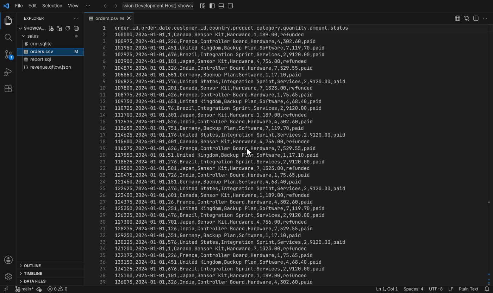
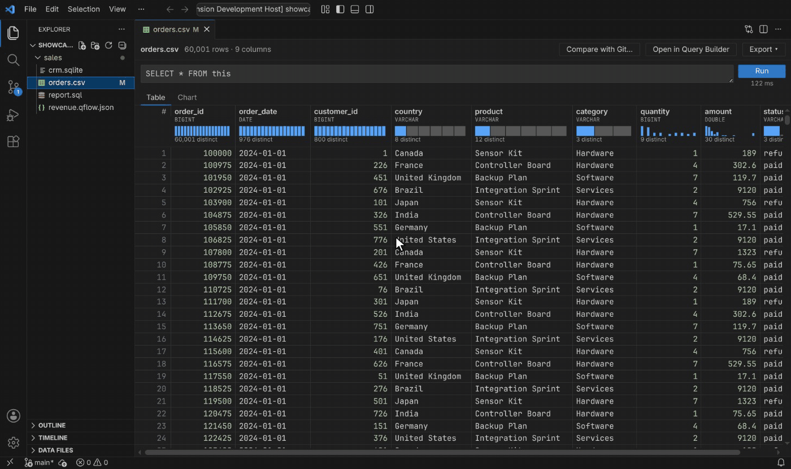
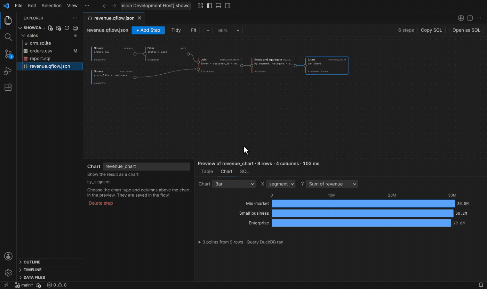
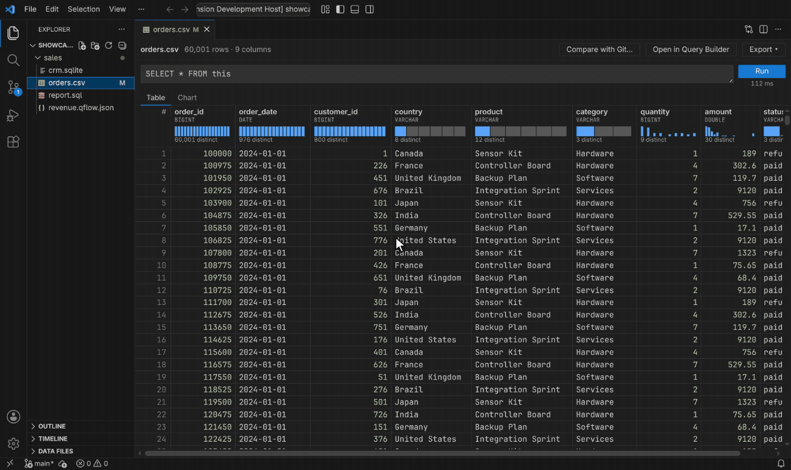

# Query Data Files

Open CSV, Parquet, JSON, Excel, SQLite and DuckDB files as tables in VS Code, and query them with SQL, a visual query builder or charts. Powered by DuckDB, so files of several gigabytes open in seconds.

## Features

- **Open any data file as a table.** Parquet, Excel, SQLite and DuckDB files open straight in the table. For CSV, TSV, JSON and JSON Lines, choose **Open in Query Data Files** from the editor title or the Explorer. Databases list their tables and workbooks their sheets.
- **Query with SQL.** The open file is `this`, and other files are named by path: `SELECT * FROM this JOIN 'customers.csv' USING (customer_id)`. Click a column name to sort, or right-click a value to filter to it; the SQL above the table updates, so you can keep editing it.
- **Column profiles** under each header show a histogram, the number of distinct values and the share of NULLs.
- **Charts** picked from your columns, grouped by DuckDB so they stay fast on millions of rows. Click a bar or point to see its rows.

  

- **Visual query builder.** Build a query as a flowchart of steps (filter, join, group, pivot, window, formula and more) with a preview of every step. Flows are saved as `.qflow.json` files and can be copied as SQL at any time.

  

- **SQL files.** Press **Ctrl+Enter** (**Cmd+Enter** on macOS) to run the statement under the cursor; the results open beside the editor. The **Data Files** view in the Explorer lists every data file with its tables and columns.
- **Compare with Git** to see the rows added, removed and changed since an earlier commit.

  

- **Export** results as CSV, Parquet, JSON or Excel, or copy them as a Markdown table.
- **Big files:** 45 million rows (3 GB of CSV) open in a few seconds and scroll end to end.
- Works offline and follows your theme. Queries can only read files in your workspace and files you open.

## Requirements

- VS Code 1.90 or later, on Windows, macOS or Linux (x64 or Arm64).

## Known Issues

- Excel support covers `.xlsx` workbooks, not the older `.xls` format.
- Files with thousands of columns take several seconds to open.
- Files must be on this computer; URLs and cloud storage aren't supported.
- CSV lines longer than 8 MB can't be read.
- In an untrusted workspace, data files open but `.sql` files and query flows don't run until you trust it.

Report issues on [GitHub](https://github.com/mashurr/query-data-files/issues).

## Release Notes

See [CHANGELOG.md](CHANGELOG.md).
